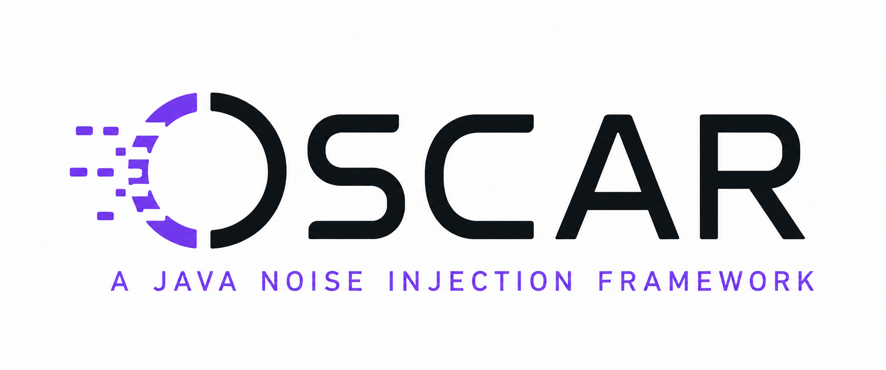

# OSCAR Noise Injector - v2



### Requirements (Tested on)

- Apache Maven 3.6.3 and Apache Maven 3.9.9
- OpenJDK 17.0.2 (Project compiles to Java 9) and OpenJDK 21.0.2

### Cloning or Downloading
The source code for OSCAR can be downloaded from Git via the following command:
```shell
git clone https://github.com/seer-lab/OSCAR.git
```
Otherwise, OSCAR can be downloaded from the most recent release on GitHub, and this bypasses
the need to build.

### Ensure Maven in Path
To ensure operation with the build and execution scripts, Maven must be in your path.
You can check if Maven is in your path by running:
```shell
mvn --version
```
Or by running the included operating system specific scripts:
#### Windows (PowerShell)

```shell
./windows_scripts/check_mvn.bat
```

#### Mac and Linux
```shell
./unix_based_scripts/check_mvn
```

### Making and Compiling (From Source)
#### Windows (PowerShell)

```shell
./windows_scripts/build_oscar.bat
```

#### Mac and Linux
```shell
./unix_based_scripts/build_oscar
```

### Executing
#### Windows
```shell
./windows_scripts/oscar.bat <arguments>
```

#### Mac and Linux
```shell
./unix_based_scripts/oscar <arguments>
```

###### Note:
If you would like to run OSCAR from anywhere, and avoid the ./ shortcut, 
the script directory for your operating system can be added to your path. 
The examples below under "OSCAR arguments" assume it is in your path.

##### OSCAR arguments

OSCAR arguments are in the form of:
```shell
oscar <targetfile> <mainclass> <outputdirectory>
```
where

- \<targetfile\> is the Java class file that you want to noise
- \<mainclass\> is the main class of the Java file that you want to noise (normally just Main)
- \<outputdirectory\> is the directory that you want the OSCAR generated file to save to

You can additionally add options to each OSCAR instrumentation. These options are:
```
OSCAR options include:
        -vb --verbose                   Flag            False           Enable full logging.
        -b --blocklist                  List            [java., sun., jdk., javax., com., org., kotlin., android., io., okhttp3., dagger., soot., oscar., $]    Set blocklisted classes by prefix (these will not be noised)
        -j --jar                        Flag            False           Inject a program as a JAR file.
        -h --help                       Flag            False           Print Help.
        -v --version                    Flag            False           Print Version.
```

##### Instrumented program arguments
Once you have an instrumented program from OSCAR, you can run the instrumented program with the following options.
```
Usage:
        java [java_options] <mainclass> [oscar_options]
                (to execute a class)
        or: java -jar <mainclass> [oscar_options]
                (to execute a jar file)

OSCAR options include:
        -a --args                       String                          Inject arguments into the program (see Note 1)
        -c --config_file                String                          Set config file location to load
        -co --console-output            Flag            False           Enable output of noising locations signals to console
        -fo --file-output               Flag            False           Enable output of noising locations signals to a file
        -lfo --lazy-file-output         Flag            False           Enable lazy output of noising locations signals to a file
        -M --max_sleep_length           Long            0               Set maximum sleep length (see Note 2)
        -m --min_sleep_length           Long            400             Set minimum sleep length (see Note 2)
        -d --disable-noise              Flag            False           Disable all noise
        -np --noise-placements          List<String>    All             Set the list of active noise placements.
        -nc --noise-categories          List<String>    All             Set the list of active noise categories.
        -pnp --print-noise-placements   Flag            -               Print all possible noise placements.
        -v --version                    Flag            -               Print OSCAR version.
        -vb --verbose                   Flag            False           Enable full logging.
        -q --quiet                      Flag            False           Disable logging.
        -h --help                       Flag            False           Print Help.

OSCAR Noise Injector 2022-2025
```

###### Notes:

Note 1: Injected arguments need to be inside quotes as such: "-a -b -c"

Note 2: Sleep lengths should be integers

### Examples:

##### Account

1. Compile the Account program source code

```sh
cd cflash_data/account
javac *.java
cd ../../..
```

2. Use OSCAR to instrument the Account program's bytecode with the noising engine's
   logic. OSCAR will wrap the original program in its routine. The outputted program will be in 
   the folder "output".

```sh
mvn exec:java -Dexec.args="cflash_data/account/Main.class Main 
output"
```
Alternatively this can be done using the provided OSCAR script. This is assuming you have OSCAR added to path.
Otherwise, refer to the "Execution" section.
```shell
oscar "cflash_data/account/Main.class" Main output
```

3. Run the instrumented program without any noise
```sh
cd output
java Main -d
```

4. Run the instrumented program with random noise between 0 and 100ms
```sh
java Main -m 0 -M 100
```

5. Run the instrumented program, only noising synchronized blocks and methods, and lazily output 
   the trace to a file.

```sh
java Main -m 0 -M 100 -nc sb -lfo
```

6. Run the instrumented program, with specific arguments.

```sh
java Main -a "5"
```

### Sources

- [Ontario Tech Paper](https://sites.fct.unl.pt/hipstr/files/lbl22_-_oscar.pdf)